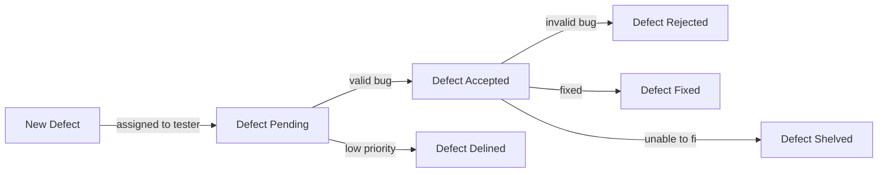
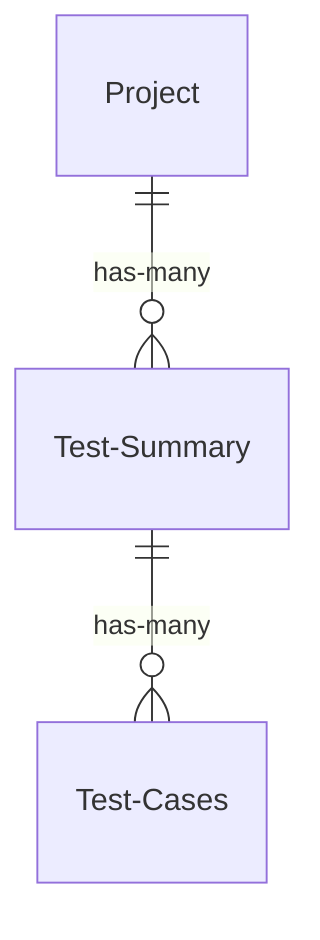

# Bug Catcher

You will be building and testing a bug reproting and test documentation framework for a company of your choosing. The company should be fictious and fun. Examples, Weyland Utani, Wayne Enterprises, Stark Industries etc.... The backend API is already constructed for you. You will build the UI and write the automation tests for it. You will be given high level user stories. You must break these down into smaller User Stories then Acceptance Criteria. 

## Testing
- Testing is just as important as development
- You must use selenium to automate these acceptance criteria.

### Defect Reporter User Stories

|As A| I Want to| So That|
|----|----------|--------|
|Tester| Sign in | I can view my custom home page|
|Manager| Sign in | I can view my custom home page| 
|Tester| View defects assigned to me| I can begin working on them|
|Tester| Update Defects | I can monitor defect progress|
|Manager| Create Defects | I can start addressing them|
|Manager| Assign Defects | The defects can be worked on |

### Defect Status
- **Pending**
  - Created and Assigned but not viewed by a tester
- **Accepted**
  - A defect to be worked on
- **Declined**
  - A defect that will not be worked on
- **Rejected** 
  - A defect that turned out to be a feature
- **Fixed**
  - Was fixed 
- **Shleved**
  - A defect that was unable to be fixed or was not worth it

#### Key Terms
- **Project**
  - A software application of the company
  - Examples
    - Employee PTO Scheduler
    - Helicopter Navigation System
- **Test Summary**
  - A report about a series of tests regarding 1 or more features for a project
    - Examples
      - Employee PTO Usability Test Results v1
      - Employee PTO Usability Test Results v2
      - Helicopter Software Responsiveness Findings 
- **Test Case**
  - A granular test of a feature
    - Examples
      - Employee Login works with correct credentials
      - Unable to login with with correct username wrong password

### Test Summarizer User Stories
|As A| I Want to| So That|
|----|----------|--------|
|Tester| Create Projects | I can attach Test Summary Reports to them later|
|Tester| Create Test Summary Reports for a project | It is easy to see what testing has been done for a project|
|Tester| Create Test Cases  for a Test Report| I can document my testing |
|Tester | Delete a Test Case | I can remove accidental Entries|
|Tester | Finalize a Test Summary Report | Management can see what testing is complete|

